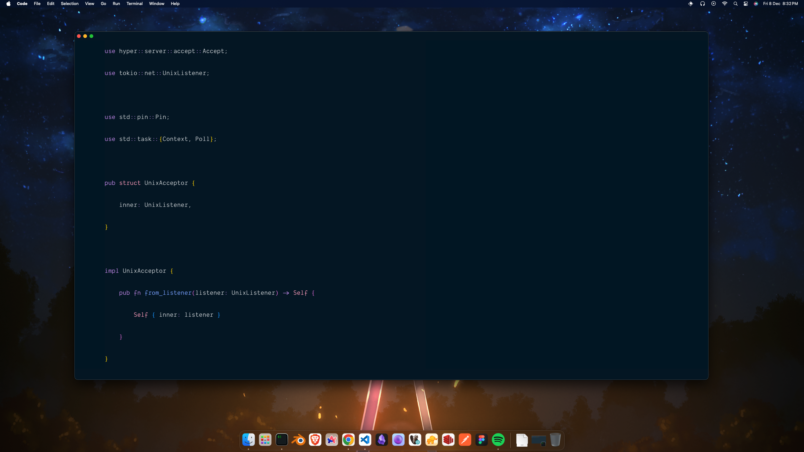

# vscode-settings
My VS Code settings.

# Extensions
- Auto Rename Tag
- Better Comments
- C/C++
- Color Highlight
- Custom CSS and JS loader
- Dracula Official
- ENV
- ESLint
- Github Copilot
- Go
- Git Graph
- Live Server
- Material Icon Theme
- Night Owl
- Path Intellisense
- Prettier
- Prisma
- Rainbow Brackets
- Tailwind CSS Intellisense
- Todo Tree
- Docker

# Theme
- Night Owl
- Just Black
- Palenight Theme
- CodeSandbox Theme

# Screenshots
 
